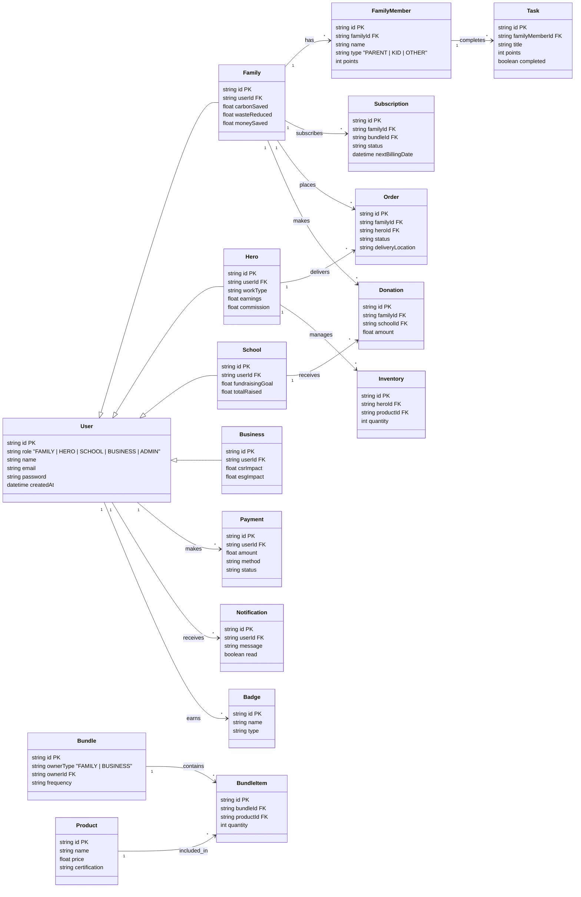

```mermaid
classDiagram
direction LR

class User {
  string id PK
  string role "FAMILY | HERO | SCHOOL | BUSINESS | ADMIN"
  string name
  string email
  string password
  datetime createdAt
}

%% Role-based Profiles (1 User = 1 Role Profile)

class Family {
  string id PK
  string userId FK
  float carbonSaved
  float wasteReduced
  float moneySaved
}

class Hero {
  string id PK
  string userId FK
  string workType
  float earnings
  float commission
}

class School {
  string id PK
  string userId FK
  float fundraisingGoal
  float totalRaised
}

class Business {
  string id PK
  string userId FK
  float csrImpact
  float esgImpact
}

%% Family Sub-Entities

class FamilyMember {
  string id PK
  string familyId FK
  string name
  string type "PARENT | KID | OTHER"
  int points
}

class Task {
  string id PK
  string familyMemberId FK
  string title
  int points
  boolean completed
}

%% Products & Bundles

class Product {
  string id PK
  string name
  float price
  string certification
}

class Bundle {
  string id PK
  string ownerType "FAMILY | BUSINESS"
  string ownerId FK
  string frequency
}

class BundleItem {
  string id PK
  string bundleId FK
  string productId FK
  int quantity
}

%% Orders & Subscriptions

class Subscription {
  string id PK
  string familyId FK
  string bundleId FK
  string status
  datetime nextBillingDate
}

class Order {
  string id PK
  string familyId FK
  string heroId FK
  string status
  string deliveryLocation
}

class Inventory {
  string id PK
  string heroId FK
  string productId FK
  int quantity
}

%% Donations & Payments

class Donation {
  string id PK
  string familyId FK
  string schoolId FK
  float amount
}

class Payment {
  string id PK
  string userId FK
  float amount
  string method
  string status
}

%% Gamification & System

class Badge {
  string id PK
  string name
  string type
}

class Notification {
  string id PK
  string userId FK
  string message
  boolean read
}

%% Inheritance (Role-based)

User <|-- Family
User <|-- Hero
User <|-- School
User <|-- Business

%% Relationships

Family "1" --> "*" FamilyMember : has
FamilyMember "1" --> "*" Task : completes

Family "1" --> "*" Subscription : subscribes
Family "1" --> "*" Order : places
Hero "1" --> "*" Order : delivers

Hero "1" --> "*" Inventory : manages

School "1" --> "*" Donation : receives
Family "1" --> "*" Donation : makes

Bundle "1" --> "*" BundleItem : contains
Product "1" --> "*" BundleItem : included_in

User "1" --> "*" Payment : makes
User "1" --> "*" Notification : receives
User "1" --> "*" Badge : earns

```